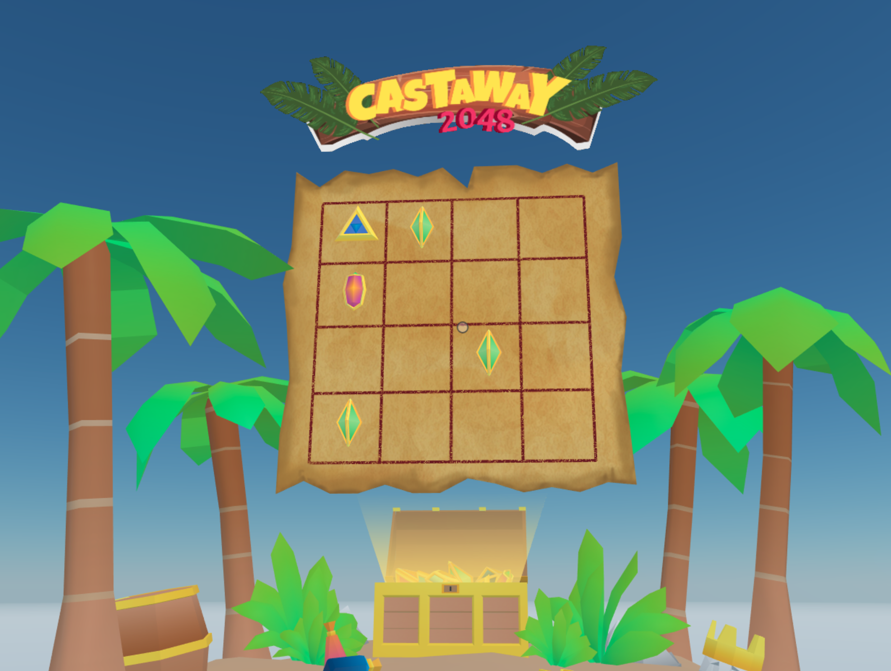

# Castaway 2048

A fully fledged game, based on the popular game 2048, where the values are represented by a series of gems of increasing values. Click and drag to displace the gems on the board and merge them into greater values till you reach 2048.



<!--
[Explore the scene](): this link takes you to a copy of the scene deployed to a remote server where you can interact with it just as if you were running `dcl start` locally.
-->

**Install the CLI**

Download and install the Decentraland CLI by running the following command

```bash
npm i -g decentraland
```

For a more details, follow the steps in the [Installation guide](https://docs.decentraland.org/documentation/installation-guide/).


**Previewing the scene**

Once you've installed the CLI, download this example and navigate to its directory from your terminal or command prompt.

_from the scene directory:_

```
$:  dcl start
```

Any dependencies are installed and then the CLI will open the scene in a new browser tab automatically.

**Usage**

Click the treasure chest to open it or to reset the game.

Click and drag in a direction to move all the gems in that direction. If two identical gems are merged, they grow into a more valuable one, keep merging them until you reach one of 2048 value.

If all the spaces are full and you can't free them by merging gems, you loose.

Learn more about how to build your own scenes in our [documentation](https://docs.decentraland.org/) site.


## Copyright info

This scene is protected with a standard Apache 2 licence. See the terms and conditions in the [LICENSE](/LICENSE) file.